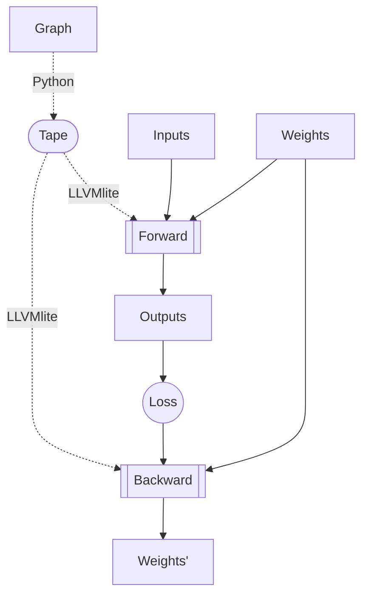

# ddag

Arbitrary sparse DAGs are a pain, you don't get any of the deeplearning gpu speedup and you pay the full price of slow python. Let's change that with LLVM.


# 1: graph --> forward-pass-able form.

Got some inspiration from:
- [micrograd](https://github.com/karpathy/micrograd)
- [tinygrad](https://github.com/geohot/tinygrad)

Started implementing it into [graph](./graph2forward.py)

```
   X0=1
   X2=2
A: pre = sum([0.3080095977715651, -1.3683164815030042])
A: A = ReLU(pre) --> 0
   X1=-1
B: pre = sum([-0.443809866372596, -1.9105361840154487])
B: B = Sin(pre) --> -0.708412616766451
C: pre = sum([-0.8049880179552675, 0.06015369169374697])
C: C = ReLU(pre) --> 0
D: pre = sum([0.0, -0.5710311874940156])
D: D = Sin(pre) --> -0.5404999194286878
E: pre = sum([0.0, -0.1280513391403928])
E: E = ReLU(pre) --> 0
   return [D,E]
```

# 2: forward-pass-able form --> LLVM
Implementing it into LLVM seems fairly straightforward but:
- [ ] how to pass arrays to cfunc?
- [ ] how to multiply arrays? manually?

Minimal llvmlite example in [fadd](fadd_llvmlite.py).

Function call example and perf. comparison using [fibonacci](fib_llvmlite.py)

I thought I'd look at how (numba does things)[array_llvmlite.py] but it's quite confusing to me.

# 3: Differentiate

Differentiation is cool but do I want it? What about some other mechanism that updates weights on activity? Maybe a learnable one?
