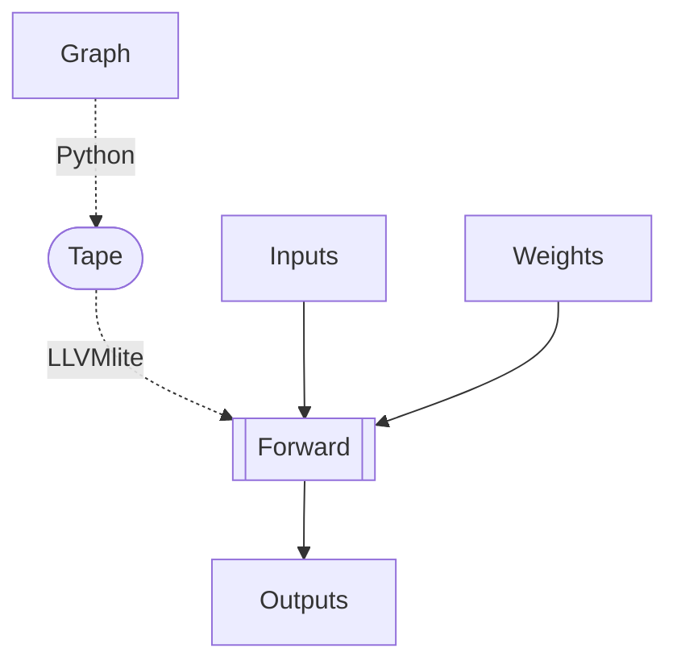

# lldag

Arbitrary sparse DAGs are a pain, you don't get any of the deeplearning gpu speedup and you pay the full price of slow python. Let's change that with LLVM.

Got some inspiration from:
- [micrograd](https://github.com/karpathy/micrograd)
- [tinygrad](https://github.com/geohot/tinygrad)

1. graph --> forward-pass-able form
2. forward-pass-able form --> LLVM
3. LLVM --> ASM

# ToDo

- [ ] Bring together extra/forward forward and backward to test implementation.
   - [ ] Last time I checked the llvm forward with a larger graph things started to get hairy (e.g. inf)
   - [ ] I don't think weights are the same between forward/backward -> FIX
