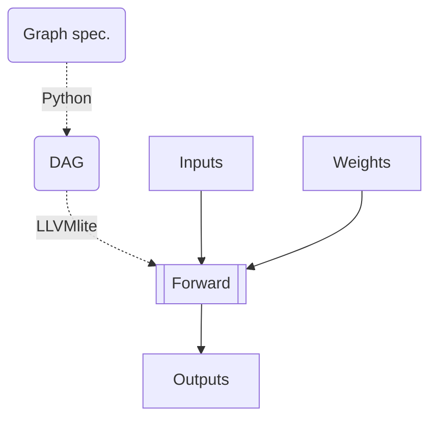

<h1 align="center">
    
    
LLDag

</h1>

Sparse DAGs not very nice to forward through. You don't get any of the deeplearning gpu speedup and you pay the full price of slow python. Let's change that with some LLVM.

Got some inspiration from:
- [micrograd](https://github.com/karpathy/micrograd) : value structure (explored in [extra/forward](https://github.com/lfrati/lldag/blob/main/extra/forward.py))
- [tinygrad](https://github.com/geohot/tinygrad) : llvm backend (closer to what we are currently [implementing](https://github.com/lfrati/lldag/blob/main/sparse_forward.py))

1. Spec. ⮕ DAG : Take a graph specification in the form of an adjacency list (e.g. node : incoming edges) and build a DAG with nodes and edges to use in generating the forward pass.
2. DAG ⮕ LLVM-IR : Compile the forward pass operation from Python 🐍 to LLVM-IR 🐉
3. LLVM ⮕ CFUNC : Optimize code and compile it into an exectutable function to call through ctypes.

